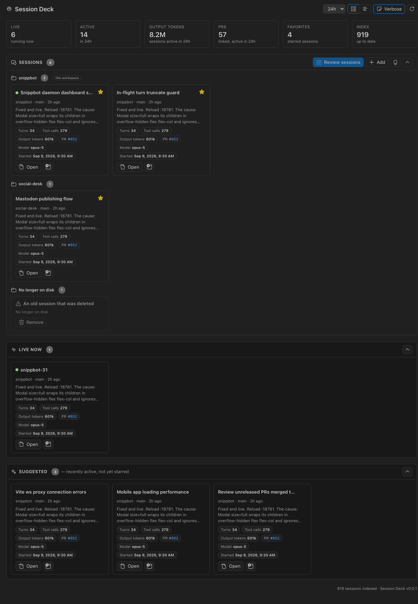
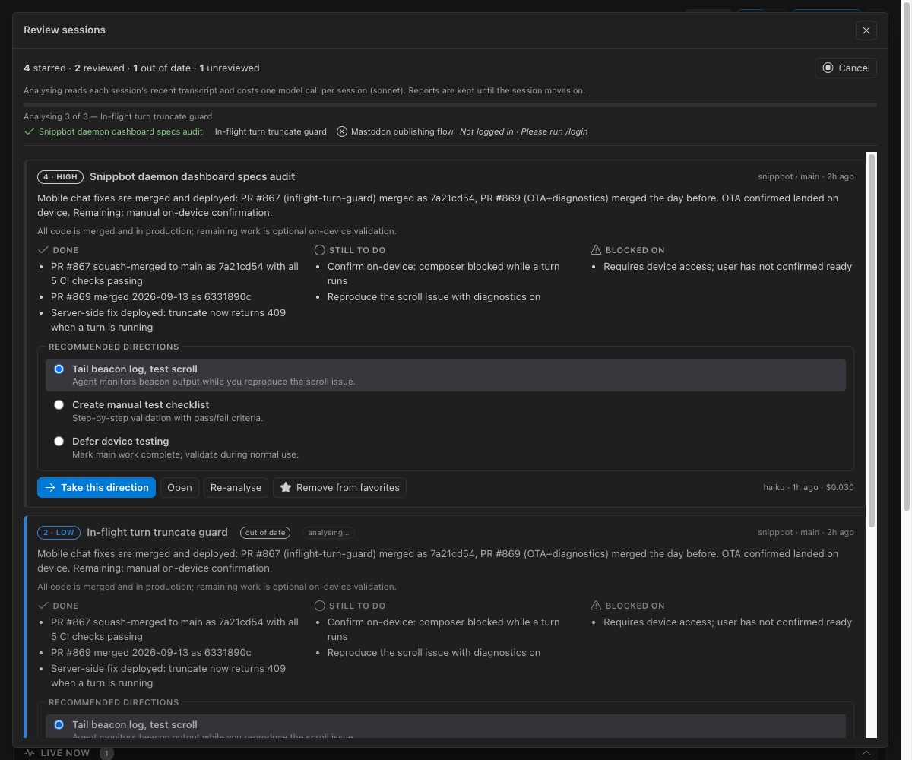

# Session Deck

A favorites dashboard for [Claude Code](https://claude.com/claude-code) sessions in VS Code. Star the
sessions you keep coming back to, see where each one stands, and jump back in with the next step
already typed.



Session Deck is an independent project and is not affiliated with Anthropic.

## What it does

- **Dashboard** — a stat strip (live sessions, activity, output tokens, PRs), your favorites grouped
  by project (this workspace first), a Live-now strip, and Suggested sessions you have not starred.
  Grid or list, a verbose switch for previews and details, drag to reorder.
- **Sidebar** — Favorites → Live now → Recent, every row with a star. `Favorite Current Session`
  stars the one running in this window.
- **Review** — one button reads each starred session's recent transcript and reports a summary,
  what is done, what is still to do, what it is blocked on, a priority (1–5), a **completion
  score** (0–100, judged against the session's own goal), and two to four directions. Choosing a
  direction — or the **Do this** / **Fix this** button on any single to-do or blocker — opens the
  session with that prompt **typed into the composer, never sent**. If that session's tab is
  already open, Session Deck closes and reopens it in place with the prompt seeded (Claude Code
  cannot seed an open composer) — unless the session is mid-turn, in which case the tab is left
  alone and the prompt, which is copied to the clipboard every time, is a ⌘V away. Reports are
  cached until the session moves on; the score also shows as a badge on each favorite card. **Ignore** hides an item you
  will not act on (**Show ignored** brings it back) — it is the same state the Board calls
  dismissed, kept in `~/.session-deck/board.json`, never a change to the report.

- **Search** — one box in the dashboard header filters everything on the page: favorites, live,
  the Board, and a **Matches** shelf listing every other session that fits, so a query reaches the
  hundreds of sessions no shelf shows. The magnifier on the sidebar runs the same matcher over the
  tree. Words are ANDed against a session's title, prompts, last-reply preview, project, branches
  and PRs (`#42`), and against the **transcript itself**: what you and Claude actually said, kept
  as plain text in the extension's own storage and brought up to date behind the index. A session
  found only that way says **matched in transcript** with a snippet of where. Details in
  [SPEC_SEARCH](docs/SPEC_SEARCH.md).

- **Board** — the `Board` switch in the header flattens every outstanding to-do and blocker from
  every starred session into one list, each tagged by what kind of work it is: **mechanical** (one
  obvious way to do it), **decision** (a human choice that changes what gets built), **yours**
  (only you can do it), or **needs triage** (the classification did not survive). Filter by kind,
  tick items off, and select any number — across sessions — to seed them back into their own
  sessions, one click per session, still typed and never sent. `session-deck board` prints the same
  queue in the terminal.

  The tags come from the review that already ran, so they cost no extra model call — and they are a
  model's judgment, not a permission system. Nothing on the Board acts on its own: there are no
  timers and no background runs, and an item is only ever shown to you or seeded into a composer
  you then read. What you tick off lives in `~/.session-deck/board.json`, keyed by the item's text,
  so it survives a re-analysis that did not reword it; an item that comes back reworded honestly
  reappears as new work rather than inheriting a state it never earned.



### When a report goes out of date

A report is stored with a fingerprint of the session it described — its message count and last
activity. Every time the dashboard rebuilds its state (you open it, a rescan finishes, a batch
ends, you star or unstar something) each cached report is compared against the session as the
index currently sees it, and it is marked **out of date** when:

- the session has moved on — more messages, or activity after the report was written,
- its transcript is gone from `~/.claude/projects`,
- or the report predates a field the current version reports (the completion score, say), so one
  analysis brings it up to date.

Nothing re-analyses itself. Out of date only changes the badge and adds the session to what
**Analyse N sessions** would cover; the model call happens when you ask for it. The same rule
drives the CLI: `session-deck review --run` skips fresh reports and re-runs stale ones unless you
pass `--force`.

## How it works, and what it costs

- Session Deck **reads** `~/.claude/projects` (the transcripts Claude Code already keeps) and
  `~/.claude/sessions` (which sessions are running). It never writes there.
- Everything it saves — favorites, cached reviews — lives in `~/.session-deck/` as plain JSON
  (`sessionDeck.dataDir`).
- Reviews run the `claude` CLI headlessly on **your own login** (`claude -p`, structured output,
  no hooks, no MCP servers, no CLAUDE.md, no session persistence). Opening the Review modal is
  free; analysing costs one model call per session — measured at 3–7¢ per session with `haiku`
  on 80-turn transcripts, so expect roughly 10–20¢ with the default `sonnet` — and the real cost
  is shown after each batch. Nothing is sent anywhere else, and
  the extension has no telemetry.
- Sessions produced by SDK / headless runs are hidden by default (`sessionDeck.showSdkSessions`).

## Opening sessions

Claude Code resumes a session only from the folder it belongs to. A favorite from this workspace
opens in the Claude Code panel; one from another repository opens a new window on that folder.
`sessionDeck.openTarget` can force a new window or a terminal running `claude --resume`.

## Settings

| Setting                        | Default              | Purpose                                               |
| ------------------------------ | -------------------- | ----------------------------------------------------- |
| `sessionDeck.dataDir`          | `~/.session-deck`    | favorites + cached reviews + board state              |
| `sessionDeck.claudeProjectsDir`| `~/.claude/projects` | read-only source; override for `CLAUDE_CONFIG_DIR`    |
| `sessionDeck.claudePath`       | auto                 | `claude` CLI for reviews (bundled → PATH → ~/.local)  |
| `sessionDeck.model`            | `sonnet`             | model alias for reviews                               |
| `sessionDeck.concurrency`      | `4`                  | parallel reviews                                      |
| `sessionDeck.transcriptTurns`  | `80`                 | recent turns a review reads                           |
| `sessionDeck.showSdkSessions`  | `false`              | list `sdk-cli` sessions                               |
| `sessionDeck.openTarget`       | `panel`              | `panel` \| `window` \| `terminal`                     |
| `sessionDeck.openInFocusView`  | `false`              | toggle Claude Code's Focus view after opening         |
| `sessionDeck.openDashboardWithSidebar` | `true`       | open the dashboard tab when the sidebar is opened     |
| `sessionDeck.indexLargeFilesMB`| `512`                | larger transcripts are indexed head+tail only         |

## Develop

```bash
pnpm install
pnpm build            # or `pnpm watch`; F5 → "Run Extension" → ⌘⇧⌥D
pnpm check            # typecheck + lint + unit tests + build
pnpm test:e2e         # smoke suite inside a real VS Code, against test/fixtures/claude
pnpm package          # builds the .vsix
```

Design notes and the phased plan are in [docs/SPEC.md](docs/SPEC.md).
